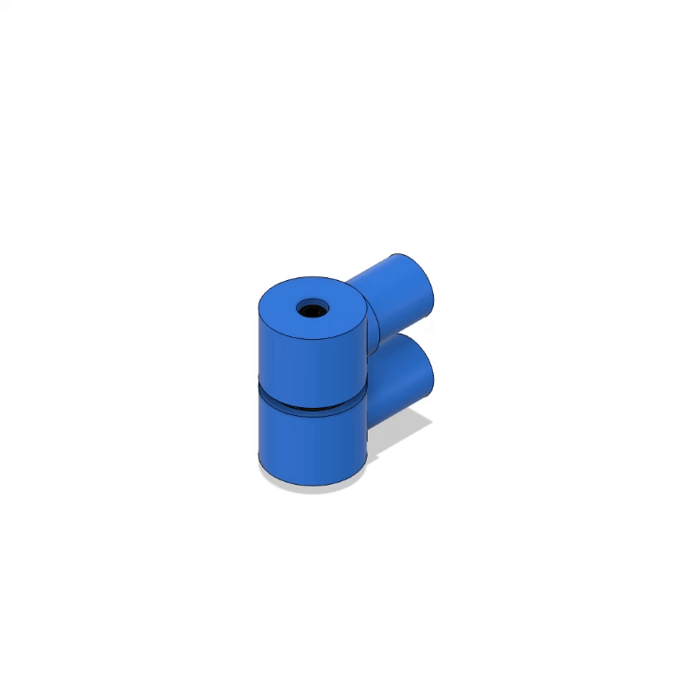

# dual-scara-arm
Dive into our Dual SCARA Robot Arm project: a cutting-edge, open-source platform for advanced kinematics in pick-and-place robotics. Ideal for hobbyists and educators, it offers precision and adaptability in automated tasks. Join and innovate in the realm of robotic technology!

